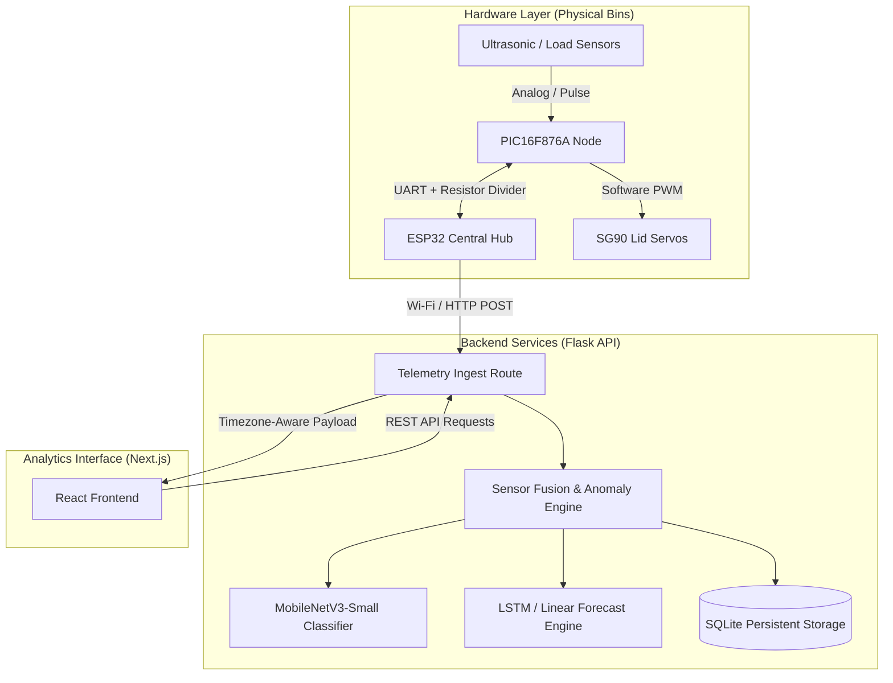

# Intelligent IoT Waste Management & Analytics System

An advanced, end-to-end solid waste management system featuring real-time telemetry concentration, server-side deep learning classification, and predictive fill analytics. The architecture combines a dedicated hardware layer (**PIC16F876A** microchips and an **ESP32** hub) with a timezone-aware **Flask API backend** and a modern **Next.js web dashboard**.

---

## 1. Overall System Architecture & Integration Flow

The system is split into three main layers: **Physical Nodes**, **Processing Backend**, and **Analytics Dashboard**.



### Complete Data & Control Flow:
1.  **Telemetry Collection**: Every 250ms, the **PIC16F876A** measures bin heights sequentially (preventing sonar cross-talk) and loads cell weights in parallel.
2.  **Serial Transfer**: The PIC serializes the data into binary frames with an XOR Checksum and transmits them via UART over a $1\text{ k}\Omega / 2\text{ k}\Omega$ level-shifted line to the **ESP32**.
3.  **Ingestion Request**: When the physical trigger button is pressed on the ESP32, it converts raw measurements ($mm \rightarrow cm$, $grams \rightarrow kg$), builds a JSON string, and sends an HTTP POST to `/api/waste`.
4.  **Anomaly Detection & Classification**:
    *   If `sensor_fault` is true, the backend records the event as anomalous and stops automated inference.
    *   Otherwise, it classifies the waste item using a thesis-consistent **MobileNetV3-Small** stub (matching the empirical $78.45\%$ test accuracy) and cross-checks telemetry metrics.
5.  **Actuation Trigger**: If the classification succeeds, the ESP32 receives the prediction response, prints it to the I2C LCD screen, and commands the PIC over UART to trigger the corresponding lid servo to open.
6.  **Predictive Analytics**: The backend runs an asynchronous forecast task using a hybrid **LSTM / Linear Regression** engine. The Next.js dashboard polls these predictions to display real-time fill capacities, anomalies, and depletion forecasts.

---

## 2. Backend Services Setup & Commands

The backend is built in **Python-Flask** and utilizes **SQLAlchemy** for database operations and **Pytest** for regression testing.

### Prerequisites
*   Python 3.10+ installed.

### Setup Steps
1.  Navigate to the backend directory:
    ```bash
    cd backend
    ```
2.  Create and activate a virtual environment:
    ```bash
    python -m venv .venv
    source .venv/bin/activate
    ```
3.  Install dependencies:
    ```bash
    pip install -r requirements.txt
    ```
4.  Initialize the SQLite Database:
    The database schema is initialized dynamically inside the Flask application context on the first run. To force-create tables or inspect settings, execute:
    ```bash
    flask shell
    ```
    Inside the python shell:
    ```python
    from backend.extensions import db
    db.create_all()
    exit()
    ```

### Run Commands
To run the Flask backend server in development mode:
```bash
python -m backend.app
```
*The server will start on port `5000` (binding to `0.0.0.0` so edge devices on your local network can reach it).*

### Run Tests
To execute the comprehensive unit test suite:
```bash
python -m pytest
```

---

## 3. Web Dashboard (Frontend) Setup & Commands

The dashboard is built using **Next.js**, **React**, and **TypeScript**, with styling powered by **Tailwind CSS**.

### Prerequisites
*   Node.js v18+ and `npm` installed.

### Setup Steps
1.  Navigate to the frontend directory:
    ```bash
    cd frontend
    ```
2.  Install packages:
    ```bash
    npm install
    ```

### Run Commands
*   **Run Development Server**:
    ```bash
    npm run dev
    ```
    *The web interface will be accessible at `http://localhost:3000`.*
*   **Compile Production Build**:
    ```bash
    npm run build
    ```
*   **Start Compiled Server**:
    ```bash
    npm run start
    ```

---

## 4. Hardware Interaction & Wiring Rules

The hardware setup utilizes point-to-point serial communication between the ESP32 (3.3V) and PIC16F876A (5V).

```
       PIC16F876A TX (5V) ---> [ 1k Ohm Resistor ] ---> ESP32 RX (3.3V Input)
                                                     |
                                             [ 2k Ohm Resistor ]
                                                     |
                                                    GND
```

### Critical Level-Shifting Connections:
1.  **PIC TX $\rightarrow$ ESP32 RX**: Pass the 5V transmit pin from the PIC through a voltage divider using a $1\text{ k}\Omega$ series resistor and a $2\text{ k}\Omega$ parallel resistor to Ground. This steps down the logic signal to a safe $3.3\text{V}$ level.
2.  **ESP32 TX $\rightarrow$ PIC RX**: Connect directly or via a $100\ \Omega$ current-limiting safety resistor. 3.3V exceeds the PIC's TTL input threshold of $2.0\text{V}$ and is safely registered as logic HIGH.
3.  **Common GND**: Always bridge the power grounds of both microcontrollers to maintain a stable serial reference voltage.

---

## 5. Serial Framing Protocol

All communication over the UART lines (9600 Baud) uses a packet structure containing an XOR Checksum to prevent noise corruption:

### Telemetry Packet (PIC $\rightarrow$ ESP32)
Sent periodically by the PIC16F876A for each bin:
`[0xAA] [Length] [Bin ID (0-3)] [Distance MSB] [Distance LSB] [Weight MSB] [Weight LSB] [Status Flags] [Lid State] [Checksum]`

*   `0xAA`: Start-Of-Frame (SOF).
*   `Length`: Total packet size in bytes (usually `0x09`).
*   `Status Flags`: Bit 0 indicates a hardware/sensor fault.

### Actuation Command (ESP32 $\rightarrow$ PIC)
Sent by the ESP32 to open a specific lid upon classification or trigger:
`[0xAA] [Length (0x03)] [Command (0x01)] [Target Bin ID (0-3)] [Checksum]`
